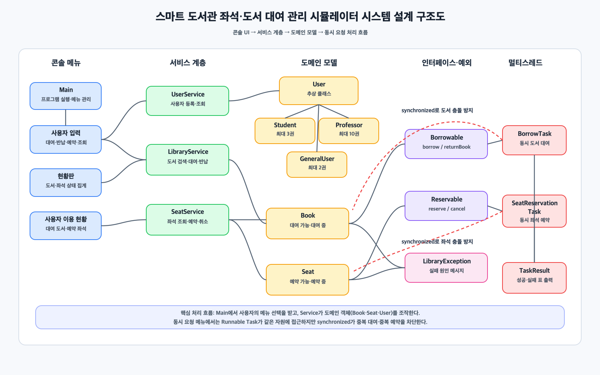

# Java 기반 스마트 도서관 좌석·도서 대여 관리 시뮬레이터 결과보고서

## 1. 프로젝트 개요

본 프로젝트는 도서관에서 발생하는 도서 대여/반납, 좌석 예약/취소, 사용자 관리, 동시 요청 처리를 콘솔 기반 Java 프로그램으로 구현한 객체지향 시뮬레이터이다.

핵심 목표는 상속, 추상 클래스, 인터페이스, 컬렉션, 예외 처리, 멀티스레드, `synchronized` 동기화를 하나의 프로그램 안에서 자연스럽게 연결해 보여주는 것이다.

## 2. 클래스 구조



```text
library
├── Main
├── model
│   ├── User (abstract)
│   ├── Student
│   ├── Professor
│   ├── GeneralUser
│   ├── Book
│   └── Seat
├── interfaces
│   ├── Borrowable
│   └── Reservable
├── service
│   ├── UserService
│   ├── LibraryService
│   └── SeatService
├── task
│   ├── BorrowTask
│   └── SeatReservationTask
└── exception
    └── LibraryException
```

## 3. 요구사항 충족 여부

| 필수 구현 기능 | 구현 여부 | 설명 |
| --- | --- | --- |
| 사용자 클래스의 상속 구조 | 완료 | `User`를 `Student`, `Professor`, `GeneralUser`가 상속 |
| 도서 대여 인터페이스 | 완료 | `Borrowable` 인터페이스를 `Book`이 구현 |
| 좌석 예약 인터페이스 | 완료 | `Reservable` 인터페이스를 `Seat`가 구현 |
| 사용자 등록 및 조회 | 완료 | `UserService`에서 사용자 저장 및 목록 출력 |
| 도서 등록, 조회, 검색, 대여, 반납 | 완료 | `LibraryService`와 `Book`에서 처리 |
| 좌석 조회, 예약, 취소 | 완료 | `SeatService`와 `Seat`에서 처리 |
| 멀티스레드 도서 대여 테스트 | 완료 | 메뉴 11번, `BorrowTask` |
| 멀티스레드 좌석 예약 테스트 | 완료 | 메뉴 12번, `SeatReservationTask` |
| `synchronized` 동기화 | 완료 | `Book`, `Seat`의 공유 자원 변경 메서드에 적용 |
| 추가 현황 기능 | 완료 | 메뉴 9번 도서관 현황판, 메뉴 10번 사용자별 이용 현황 |

## 4. 평가 기준 충족표

| 과제 요구사항 | 구현 내용 | 확인 위치 | 상태 |
| --- | --- | --- | --- |
| 사용자 클래스 상속 구조 | `User` 추상 클래스와 `Student`, `Professor`, `GeneralUser` 하위 클래스 구현 | `model` 패키지 | 완료 |
| 도서 대여 인터페이스 | `Borrowable` 구현 및 `Book.borrow()`, `Book.returnBook()` 오버라이딩 | `interfaces`, `model.Book` | 완료 |
| 좌석 예약 인터페이스 | `Reservable` 구현 및 `Seat.reserve()`, `Seat.cancel()` 오버라이딩 | `interfaces`, `model.Seat` | 완료 |
| 사용자 등록 및 조회 | `UserService`와 메뉴 1번 사용자 목록 조회 기능 구현 | `service.UserService` | 완료 |
| 도서 등록, 조회, 검색, 대여, 반납 | `LibraryService`와 메뉴 2~5번 기능 구현 | `service.LibraryService` | 완료 |
| 좌석 조회, 예약, 취소 | `SeatService`와 메뉴 6~8번 기능 구현 | `service.SeatService` | 완료 |
| 멀티스레드 동시 요청 테스트 | `BorrowTask`, `SeatReservationTask`, 메뉴 11~12번 자동 시연 구현 | `task` 패키지 | 완료 |
| `synchronized` 충돌 방지 | `Book`과 `Seat`의 핵심 상태 변경 메서드에 `synchronized` 적용 | `Book`, `Seat` | 완료 |

본 프로젝트는 과제에서 요구한 상속, 추상 클래스, 인터페이스, 컬렉션, 예외 처리, 멀티스레드, `synchronized` 동기화 요소를 모두 포함한다. 또한 도서관 현황판과 사용자별 이용 현황을 추가하여 단순 요구사항 충족을 넘어 관리 시스템에 가까운 완성도를 목표로 했다.

## 5. 상속 및 추상 클래스 적용

`User`는 사용자 공통 정보를 관리하는 추상 클래스이다. `Student`, `Professor`, `GeneralUser`는 `User`를 상속하며 사용자 유형별 최대 대여 가능 권수를 다르게 오버라이딩한다.

| 사용자 유형 | 클래스 | 최대 대여 가능 권수 |
| --- | --- | --- |
| 학생 | `Student` | 3권 |
| 교수 | `Professor` | 10권 |
| 일반 회원 | `GeneralUser` | 2권 |

이를 통해 같은 `User` 타입으로 사용자들을 관리하면서도 실제 동작은 하위 클래스의 정책에 따라 달라지는 다형성을 구현했다.

## 6. 인터페이스 적용

`Borrowable` 인터페이스는 대여 가능한 객체의 공통 기능을 정의한다.

```java
void borrow(User user) throws LibraryException;
void returnBook(User user) throws LibraryException;
```

`Reservable` 인터페이스는 예약 가능한 객체의 공통 기능을 정의한다.

```java
void reserve(User user) throws LibraryException;
void cancel(User user) throws LibraryException;
```

`Book`은 `Borrowable`을 구현하고, `Seat`는 `Reservable`을 구현한다. 이를 통해 도서와 좌석의 기능을 명확히 분리했다.

## 7. 멀티스레드 및 동기화 처리

도서와 좌석은 여러 사용자가 동시에 접근할 수 있는 공유 자원이다. 같은 도서가 여러 명에게 동시에 대여되거나, 같은 좌석이 여러 명에게 동시에 예약되는 문제를 방지하기 위해 `Book`과 `Seat`의 핵심 메서드에 `synchronized`를 적용했다.

```java
public synchronized void borrow(User user) throws LibraryException
public synchronized void returnBook(User user) throws LibraryException
public synchronized void reserve(User user) throws LibraryException
public synchronized void cancel(User user) throws LibraryException
```

`BorrowTask`와 `SeatReservationTask`는 `Runnable`을 구현하여 여러 사용자가 같은 자원을 동시에 요청하는 상황을 재현한다. 메뉴 11번과 12번은 일반 사용 기능이라기보다 동시성 요구사항을 보여주기 위한 자동 시연 메뉴이다.

## 8. 멀티스레드 검증표

| 검증 항목 | 동시 요청 수 | 성공 수 | 실패 수 | 검증 결과 |
| --- | --- | --- | --- | --- |
| 같은 도서 동시 대여 | 5명 | 1명 | 4명 | 중복 대여 없음 |
| 같은 좌석 동시 예약 | 5명 | 1명 | 4명 | 중복 예약 없음 |
| 학생 대여 한도 초과 | 4번째 대여 시도 | 0명 | 1명 | 최대 3권 정책 유지 |
| 타인 도서 반납 시도 | 1회 | 0명 | 1명 | 대여자 검증 성공 |
| 타인 좌석 취소 시도 | 1회 | 0명 | 1명 | 예약자 검증 성공 |

멀티스레드는 실행 순서가 매번 완전히 동일하지 않을 수 있다. 그러나 최종 상태는 항상 하나의 사용자에게만 배정되어야 한다. 본 프로젝트는 `Book`과 `Seat`의 상태 변경 메서드에 `synchronized`를 적용하여 실행 순서와 무관하게 같은 도서와 좌석이 중복 배정되지 않도록 구현했다.

## 9. 실행 결과 예시

### 도서관 현황판

```text
도서관 현황판
등록 사용자  : 5명
전체 도서    : 6권
대여 가능    : 5권
대여 중      : 1권
전체 좌석    : 8석
예약 가능    : 7석
예약 중      : 1석
```

### 사용자별 이용 현황

```text
사용자별 이용 현황
사용자      : [학생] 김학생(U001)
대여 현황   : 1/3권

[대여 도서]
- B001 | 이것이 자바다 | 신용권

[예약 좌석]
- S01
```

### 멀티스레드 도서 대여 테스트

```text
멀티스레드 도서 대여 자동 시연
목표: 여러 사용자가 같은 책을 동시에 요청해도 대여자는 1명만 나와야 합니다.
[1단계] 테스트용 사용자 5명이 같은 도서를 동시에 요청합니다.
[2단계] Book.borrow()의 synchronized가 한 번에 한 요청만 처리합니다.

[3단계] 동시 요청 처리 결과
스레드         사용자        결과      설명
BorrowTask-1  동시학생1     성공      '동시성 제어 완전정복' 대여 성공
BorrowTask-2  동시학생2     실패      이미 대여 중인 도서입니다. 현재 대여자: 동시학생1
[최종 도서 상태] BT-THREAD | 동시성 제어 완전정복 | Smart Library Lab | 대여 중(동시학생1)
[결론] 성공 1명, 실패 4명입니다. 같은 책은 동시에 여러 명에게 대여되지 않았습니다.
```

### 멀티스레드 좌석 예약 테스트

```text
멀티스레드 좌석 예약 자동 시연
목표: 여러 사용자가 같은 좌석을 동시에 요청해도 예약자는 1명만 나와야 합니다.
[1단계] 테스트용 사용자 5명이 같은 좌석을 동시에 요청합니다.
[2단계] Seat.reserve()의 synchronized가 한 번에 한 요청만 처리합니다.

[3단계] 동시 요청 처리 결과
스레드         사용자        결과      설명
SeatTask-1    동시학생1     성공      ST-THREAD 좌석 예약 성공
SeatTask-2    동시학생2     실패      이미 예약된 좌석입니다. 현재 예약자: 동시학생1
[최종 좌석 상태] ST-THREAD | 예약 중(동시학생1)
[결론] 성공 1명, 실패 4명입니다. 같은 좌석은 동시에 여러 명에게 예약되지 않았습니다.
```

## 10. 차별화 포인트

본 프로젝트는 단순히 필수 기능을 나열하는 수준에서 멈추지 않고, 채점자가 실행 즉시 시스템 완성도를 확인할 수 있도록 현황판, 사용자별 이용 현황, 정리된 멀티스레드 결과표를 추가했다.

특히 멀티스레드 자동 시연은 스레드 출력 순서가 섞여 초보자가 이해하기 어려운 문제를 줄이기 위해 `TaskResult` 객체에 결과를 저장한 뒤 성공/실패 표로 정리하도록 설계했다. 이 구조는 동시성 자체는 실제 `Thread`로 실행하면서도, 보고서와 실행 화면에서는 검증 결과를 명확하게 전달할 수 있다는 장점이 있다.

## 11. 기술적 회고

이번 프로젝트에서 가장 중요한 학습 지점은 객체지향 설계와 멀티스레드 제어가 서로 분리된 개념이 아니라는 점이었다. `User`, `Book`, `Seat` 객체가 각자의 상태를 책임지고, Service 클래스가 기능 흐름을 조율하며, Task 클래스가 동시 요청 상황을 만들어 주도록 역할을 나누면서 프로그램의 구조가 명확해졌다.

또한 `synchronized`를 단순히 키워드로 사용하는 것이 아니라, 어떤 메서드가 공유 자원의 상태를 바꾸는 핵심 지점인지 판단한 뒤 `Book.borrow()`, `Book.returnBook()`, `Seat.reserve()`, `Seat.cancel()`에 적용했다. 이를 통해 같은 도서나 좌석이 동시에 여러 사용자에게 배정되는 문제를 구조적으로 차단할 수 있었다.

## 12. 개선 가능성

- 파일 저장 기능을 추가하면 프로그램 종료 후에도 사용자, 도서, 좌석 상태를 유지할 수 있다.
- 도서 연체일, 벌점, 예약 대기열 기능을 추가하면 실제 도서관 시스템에 더 가까워진다.
- GUI 또는 웹 UI를 붙이면 사용성이 향상된다.
